# Smart Savers

## Our Brief
We have created a money management mobile application for 8 to 12 years olds that would teach them financial literacy. The app includes the following features:

- Authenticated Login: Parents must log in with their credentials to access the app's features, ensuring their data is secure.

- Record and Categorise Transactions: Users can record their financial transactions, categorising them into different income expense categories for better budgeting and understanding of their spending habits.

- Complete Interactive Challenges: The app offers interactive financial challenges to users, encouraging them to make informed financial decisions and develop responsible money management skills.

- Earn Rewards / Level Up: By completing challenges, users can earn rewards and level up, fostering a sense of achievement and progress in their financial journey.

- Create a Monetary Goal & Record Progress: Users can set monetary goals, such as saving for a specific item or target amount, and track their progress towards achieving these goals.

- Select a Profile Picture: Users have the option to personalise their profiles by selecting a profile picture based on their favourite animal, making the app experience more engaging and enjoyable.

### Extension:
As an extension to the core features, the app provides a visual breakdown of users' spending and income. This feature enables users to gain insights into their financial patterns through easy-to-understand charts and graphs, helping them make more informed decisions about their money.

### With these features, our Smart Savers app aims to empower young users with essential financial skills and knowledge, setting them on a path of financial responsibility and independence. 

## Demo
[Please watch a demonstration of our app by clicking here](https://www.youtube.com/watch?v=K_ngJpReB6Q)

## Screenshots

| Login Screen                   | Home Screen                   | Daily Challenges              | Pie Chart Income                |
|:------------------------------:|:------------------------------:|:-----------------------------:|:-------------------------------:|
| 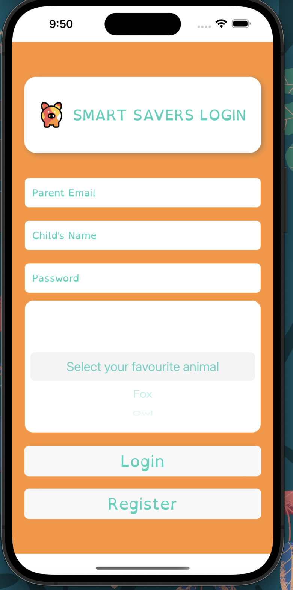 | 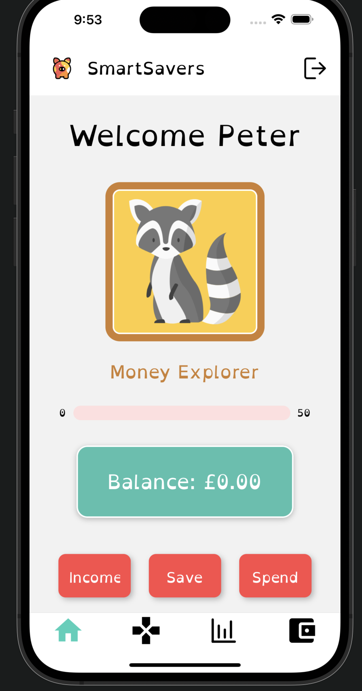 | 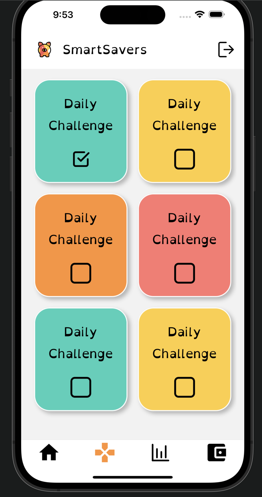 | 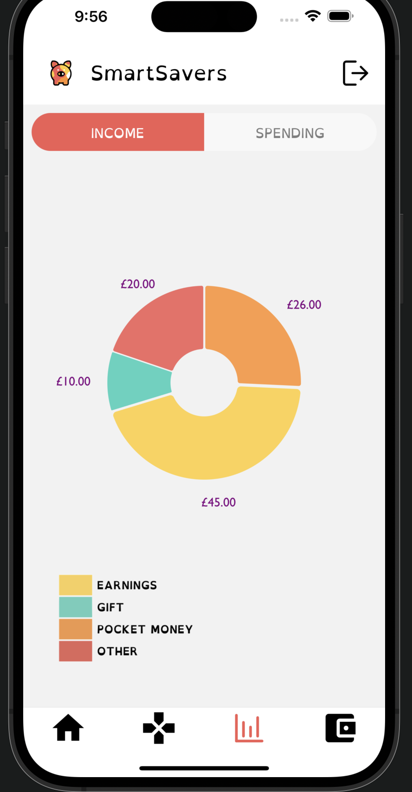 |
| One Daily Challenge            | Point Level Badge and Points Progress | Next Level Badge            | Expenses Chart                  |
|  | 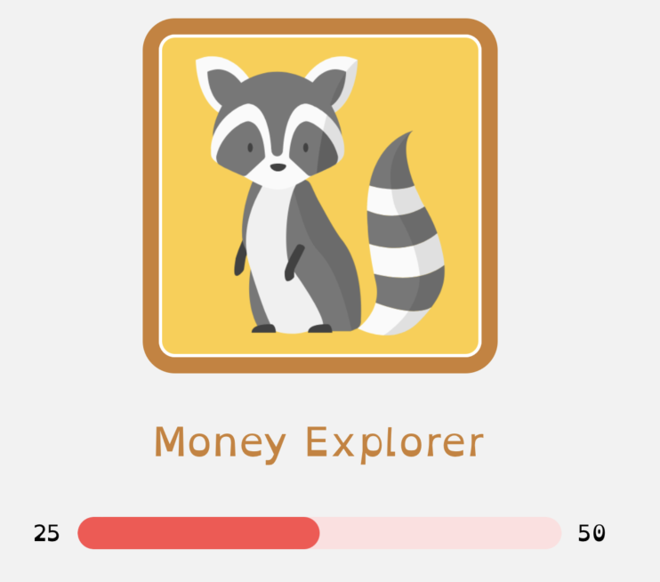 | 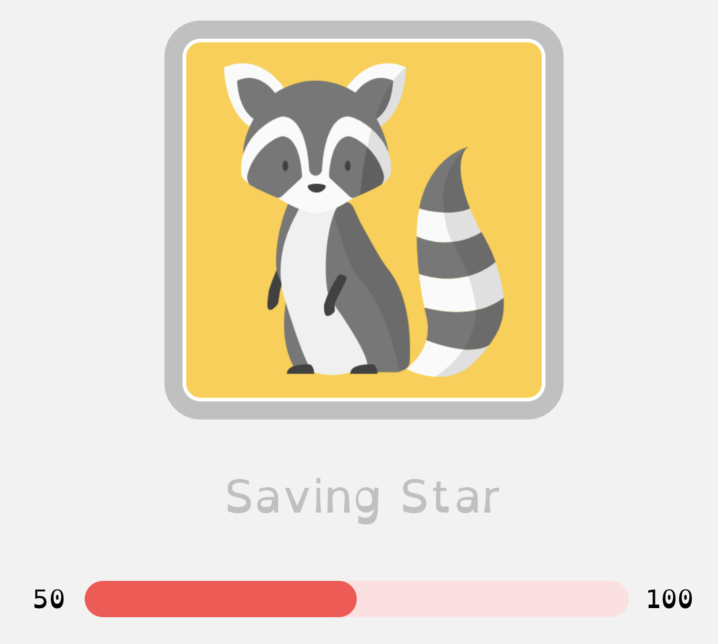 | 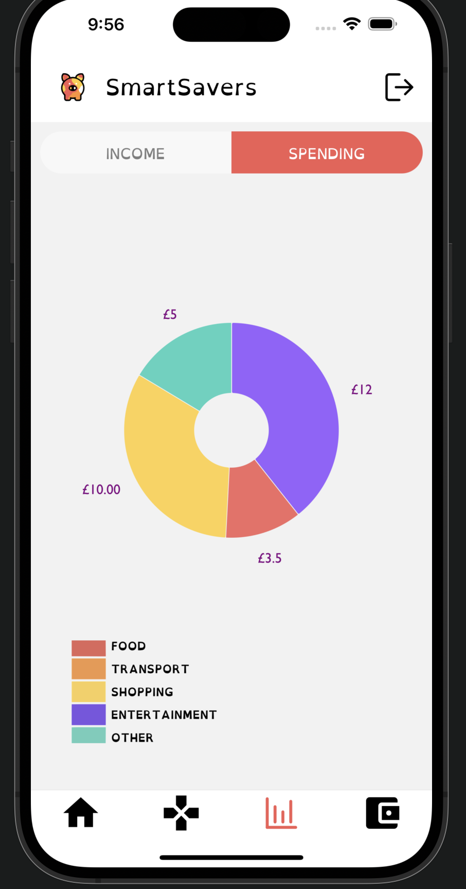 |
| Top Level Badge                | Balance and Transaction Buttons | Savings Pockets               | Updated Savings Pocket          |
| 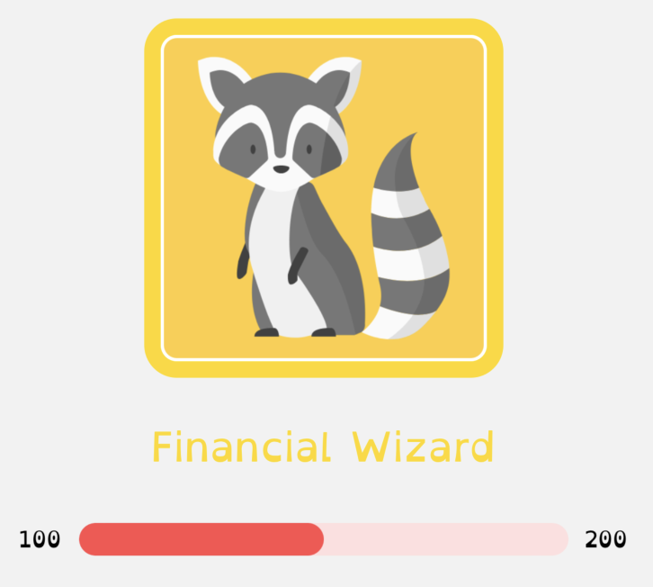 | 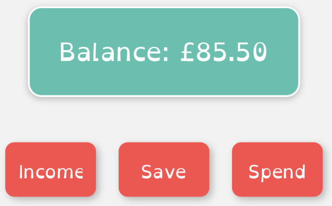 | 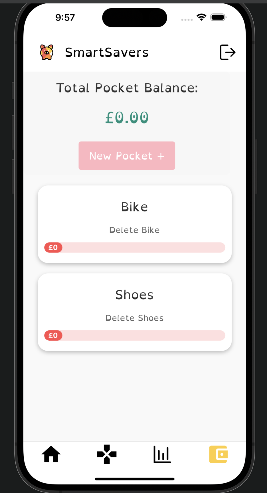 | 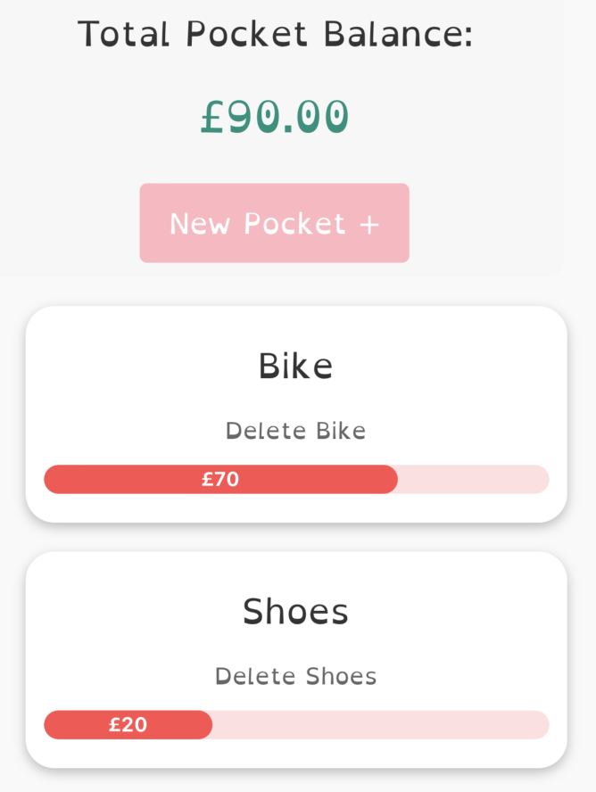 |


## Tech Stack
### Frontend:
- React Native (Expo Go)
- TypeScript
- Lottie (for animations)
- Victory Pie Charts (for interactive pie charts)
### Backend:
- Java (Spring Framework)
### Database:
- PostgreSQL

## Prerequisites
Before running the app locally, ensure you have the following installed:
- [Node.js](https://nodejs.org/)
- [Expo Go](https://docs.expo.dev/)

- [Java Development Kit](https://www.oracle.com/uk/java/technologies/downloads/)


## Setup Instructions
1. Clone the repository to your local machine:

```bash 
git clone https://github.com/BBilgili15/smart_savers
```


2. Change directory to the project folder:
```
cd your-repo
```


3. Install dependencies:
```bash
npm install
```


4. Start the Expo development server:
```bash
npm start
```


5. Use the Expo Go app on your Android or iOS device to scan the QR code from the Expo development server. Alternatively, you can use an Android emulator or iOS simulator to run the app.

6. To connect to your backend (Java Spring), update the appropriate API URLs in the codebase to match your backend's endpoints.

## Firebase Setup
1. Go to the [Firebase Console](https://console.firebase.google.com/) and sign in with your Google account.

2. Click on "Add Project" and follow the on-screen instructions to create a new Firebase project. Choose a unique project name and select your preferred region.

3. Once the project is created, click on "Web" under "Build" to add a web app to your Firebase project.

4. Provide a name for your app and click "Register App."

5. Firebase will generate your web app's configuration. Copy the configuration details (apiKey, authDomain, projectId, storageBucket, messagingSenderId, appId) as you'll need them later.

## Firebase Setup - FrontEnd

In your React Native Expo project, navigate to the `FirebaseConfig.ts` file (or create one if it doesn't exist) and paste the Firebase configuration details:

   ```javascript
   // FirebaseConfig.ts

   import { initializeApp } from 'firebase/app';

   const firebaseConfig = {
     apiKey: 'YOUR_API_KEY',
     authDomain: 'YOUR_AUTH_DOMAIN',
     projectId: 'YOUR_PROJECT_ID',
     storageBucket: 'YOUR_STORAGE_BUCKET',
     messagingSenderId: 'YOUR_MESSAGING_SENDER_ID',
     appId: 'YOUR_APP_ID',
   };

   const app = initializeApp(firebaseConfig);

   export { app as FirebaseAuth };
   ```

Replace the placeholders (YOUR_API_KEY, YOUR_AUTH_DOMAIN, etc.) with the corresponding values from your Firebase project's configuration.

## Firebase - Backend

In your Java Spring backend project, you'll need to configure Firebase Admin SDK. Follow the official Firebase Admin SDK setup guide for Java to set up Firebase in your backend:

[Firebase Admin SDK Setup Guide for Java](https://firebase.google.com/docs/admin/setup#java)

Once you have set up the Firebase Admin SDK in your Java backend, you can use the Firebase Admin SDK APIs to interact with your Firebase project. For example, you can use it to authenticate users, access the Firebase Realtime Database, Cloud Firestore, and other Firebase services from your Java Spring application.


## Contributors
- [Zhu Meng](https://www.linkedin.com/in/zhu-m-scott-0b939a245/)
- [Ben Bilgili](https://www.linkedin.com/in/benan-bilgili-a6a2b2196/)
- [Sam Bartram](https://www.linkedin.com/in/sambartram/)

## Additional Libraries
The following libraries were used in this project:

### Lottie

Lottie is used for adding beautiful animations to the app. It allows us to use After Effects animations in our React Native app seamlessly.
[More About Lottie](https://github.com/lottie-react-native/lottie-react-native)

### Victory Pie Charts

Victory Pie Charts is used for displaying visually appealing and interactive pie charts in the app. It provides various customization options.
[More About Victory](https://github.com/FormidableLabs/victory) 


